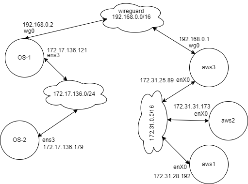

### Multi Node Data Retrieveal System  

It is a system which is distributed on 5 nodes, and each node serving a different purpose to the application. The inter-connect connectivity of the network is depicted in the below diagram.  

